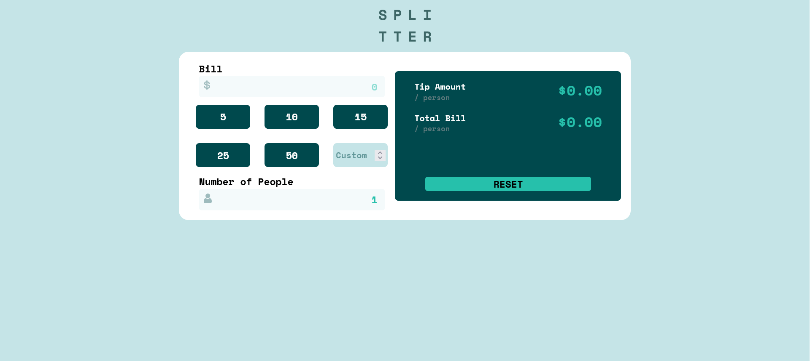

# Frontend Mentor - Tip Calculator Solution

This is a solution to the [Tip calculator app challenge on Frontend Mentor](https://www.frontendmentor.io/challenges/tip-calculator-app-ugJNGbJUX). Frontend Mentor challenges help you improve your coding skills by building realistic projects.

## Overview

### Screenshot

### Links

- Solution URL: [Add solution URL here](https://github.com/siyam-eng/tip-calculator-react)
- Live Site URL: [Add live site URL here](https://siyam-eng.github.io/tip-calculator-react)

## My process

### Built with

- React
- Tailwind CSS

### What I learned

Learned to manage state in react with form inputs and buttons along with implementing prop drilling and moving the state up! It's a good project to practice the basics of React

## Author

- Website - [Siyam Ahmed](https://siyamahmed.com)
- Frontend Mentor - [@Siyam1888](https://www.frontendmentor.io/profile/Siyam1888)
- Twitter - [@siyam_88](https://www.twitter.com/siyam_88)
